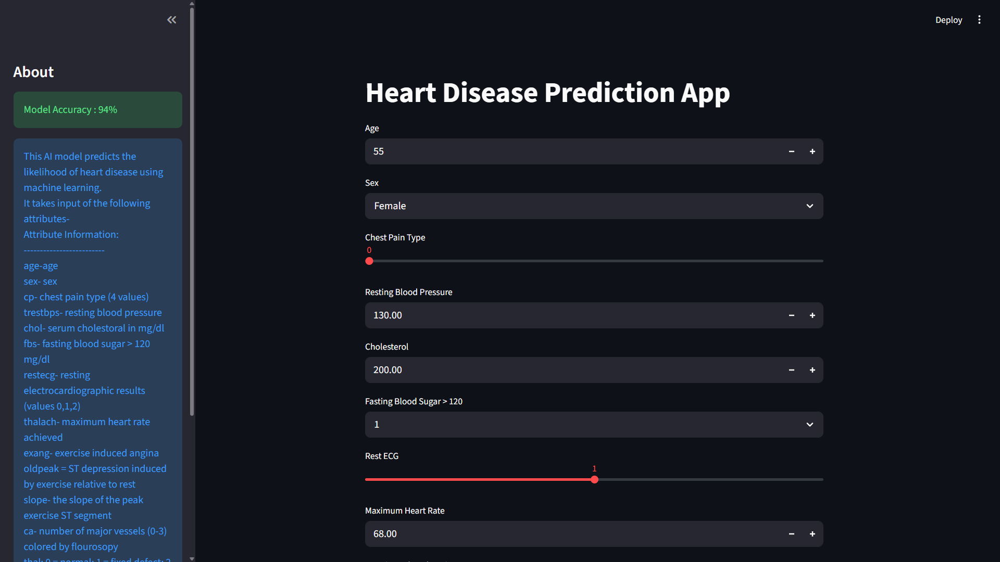
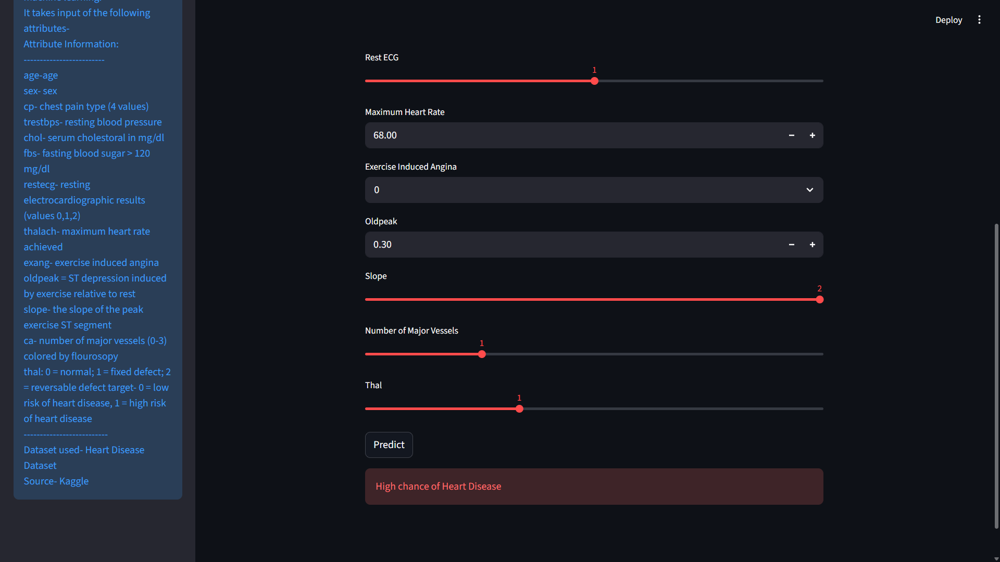

# 🫀Heart Disease Prediction System
-----------------------------------------------
A machine learning project that predicts the likelihood of heart disease using patient health data.

## Features-  
Data preprocessin  
Exploratory Data Analysis  
KNN Classification  
Model evaluation and accuracy comparison

## Tech Stack-  
Python  
Pandas  
NumPy  
Scikit-learn  
Matplotlib  
Seaborn  
Jupyter Notebook

## Dataset-  
Heart Disease Prediction Dataset from Kaggle repository.  
### Attribute Information:  
    -------------------------  
    age-age  
    sex- sex  
    cp- chest pain type (4 values)  
    trestbps- resting blood pressure  
    chol- serum cholestoral in mg/dl  
    fbs- fasting blood sugar > 120 mg/dl  
    restecg- resting electrocardiographic results (values 0,1,2)  
    thalach- maximum heart rate achieved  
    exang- exercise induced angina  
    oldpeak = ST depression induced by exercise relative to rest  
    slope- the slope of the peak exercise ST segment  
    ca- number of major vessels (0-3) colored by flourosopy  
    thal: 0 = normal; 1 = fixed defect; 2 = reversable defect
    target- 0 = low risk of heart disease, 1 = high risk of heart disease  
    --------------------------  
    Dataset used- Heart Disease Dataset
    Source- Kaggle

## Results-
Achieved approximately 94% accuracy using KNN Classification.

## Application Preview-  
### Home Page  
  
### Prediction Result  

## Future Improvements-  
Hyperparameter tuning  
Trying advanced models  
Deploying using Flask/Streamlit

Author-  
Preetika Mishra